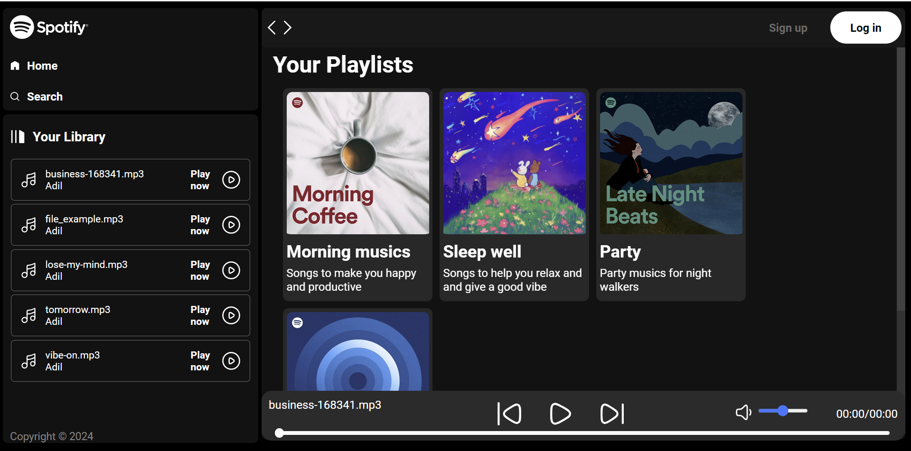

# Music Application

1. **Clone the repository:**
    ```bash
    git clone https://github.com/Aadil404/music_application.git
    cd music_application
    ```
2. **Access the app:**
    ```bash
    The app will be running at your local host
    ```
### Dashboard


